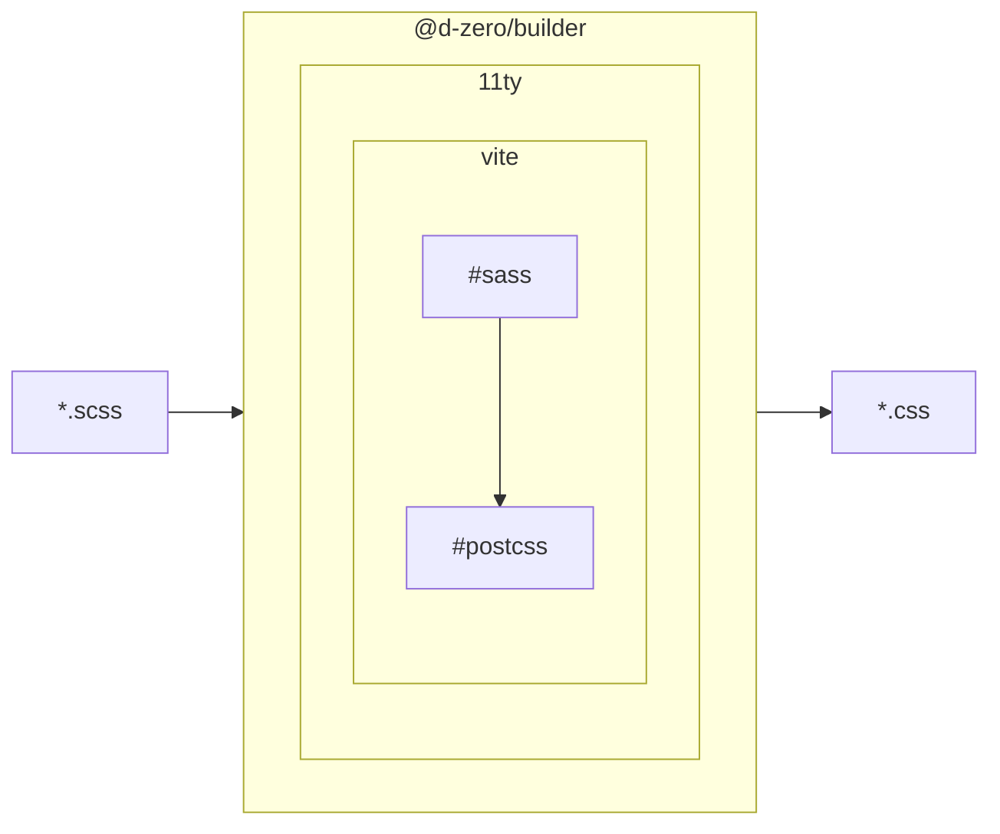

# ビルド環境

11tyのTransform機能から[ViteのCSS変換](https://ja.vitejs.dev/guide/features#css)を利用します。プリプロセッサーはSassを利用します。



## ベンダープレフィックス

Autoprefixerを利用するのでベンダープレフィックス付きのプロパティは必要ありません。

```scss
selector {
	transition: opacity 300ms;
	-webkit-transition: opacity 300ms; // ❌ 不要
	-moz-transition: opacity 300ms; // ❌ 不要
}
```

ただしCSSの標準規格でないものについては必要なケースがあります。Stylelintはその点を考慮して警告を出すので心配はありません。

```scss
selector {
	-moz-osx-font-smoothing: grayscale; // ✅ ブラウザ固有のプロパティのためプレフィックは必要
	-webkit-font-smoothing: antialiased; // ✅ ブラウザ固有のプロパティのためプレフィックは必要
}
```

::: tip 🔧 自動修正可能
このルールは*Stylelint*によって自動修正されます。
:::
