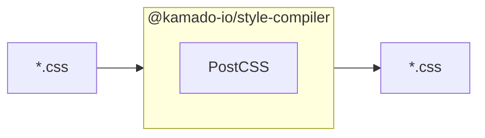

# ビルド環境

`@kamado-io/style-compiler`を通して*PostCSS*を利用してCSS変換を行います。CSSは*PostCSS*のみを使用します。


```mermaid
flowchart LR
	#in["*.css"]
	#out["*.css"]
	#styleCompiler["@kamado-io/style-compiler"]

	#in --> #styleCompiler --> #out

	subgraph #styleCompiler["@kamado-io/style-compiler"]
		direction TB
		#postcss["PostCSS"]
	end
```

`kamado.config.ts`で設定を行います。

```ts
import type { UserConfig } from 'kamado/config';

import path from 'node:path';

import { styleCompiler } from '@kamado-io/style-compiler';

export const config: UserConfig = {
	compilers: {
		style: styleCompiler({
			alias: {
				'@': path.resolve(import.meta.dirname, '__assets', '_libs'),
			},
		}),
	},
};

export default config;
```

## パスエイリアス

`alias`オプションでパスエイリアスを設定できます。PostCSSの`@import`で使用されます。

```ts
styleCompiler({
	alias: {
		'@': path.resolve(import.meta.dirname, '__assets', '_libs'),
	},
})
```

## ベンダープレフィックス

*Autoprefixer*を利用するのでベンダープレフィックス付きのプロパティは必要ありません。

```css
selector {
	transition: opacity 300ms;
	-webkit-transition: opacity 300ms; /* ❌ 不要 */
	-moz-transition: opacity 300ms; /* ❌ 不要 */
}
```

ただしCSSの標準規格でないものについては必要なケースがあります。*Stylelint*はその点を考慮して警告を出すので心配はありません。

```css
selector {
	-moz-osx-font-smoothing: grayscale; /* ✅ ブラウザ固有のプロパティのためプレフィックは必要 */
	-webkit-font-smoothing: antialiased; /* ✅ ブラウザ固有のプロパティのためプレフィックは必要 */
}
```

::: tip 🔧 自動修正可能
このルールは*Stylelint*によって自動修正されます。
:::
