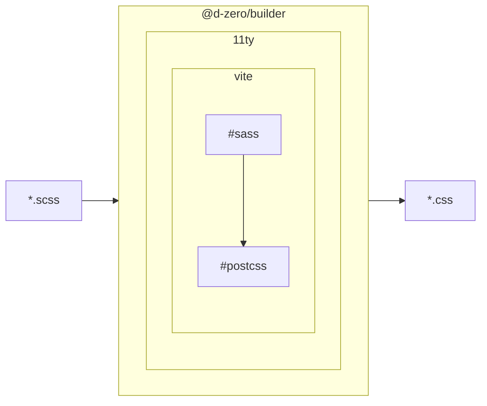
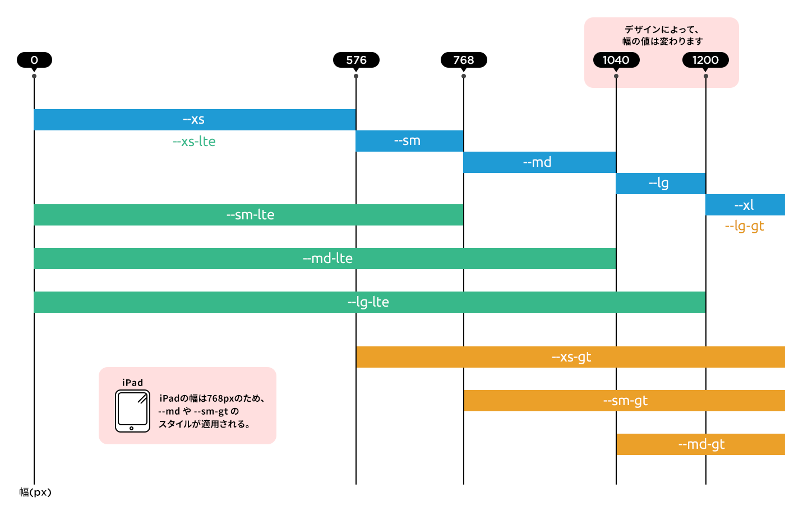

# CSS ガイドライン

🔰 当ドキュメントは「[コーディングガイドライン](../index.md)」の一部です。
基本的なガイドライン・ルールについては先にそれから確認してください。

## 🎯 CSS ガイドラインの目的

CSSのガイドラインは次の3つを主な目的として策定されています。

- 確実性
  - 影響範囲が明瞭であること
  - 確実に場所を特定して追加・変更ができること
- 機能性
  - 命名規則が機能的でその機能が予測し易くあること
  - プロジェクトにヘルプアサインされてもほとんどが判断がつくこと
- 一貫性
  - 一貫した汎用ルールがあることでプロジェクト独自ルールの氾濫を避けられること
  - プロジェクトをまたいでも混乱することがないこと

### 作用をきちんと理解する

「何故か解らないけど出来た」は一番やってはいけません。プロパティひとつひとつ、セレクタひとつひとつが、どういった作用をするかきちんと理解してコーディングすることを心掛けてください。

### 別解を用意すること

ほとんどの場合、表現の方法はひとつではありません。メンテナンス性を優先させた方法、パフォーマンスを優先させた方法など、そのときそのときで最適な方法を探す必要があります。常にいくつかのパターンを考えながらコーディングできるように心掛けてください。また、万が一にブラウザの予期せぬバグに遭遇した際にも別解で解決する必要があります。

## 💅 コードスタイル

_editorconfig_、_Stylelint_、_Prettier_ それぞれに設定されているルールに則って記述します。エディタやコマンド実行時に警告が出た場合は**必ず修正してください**。

各設定は以下のパッケージを利用しています。

- [@d-zero/stylelint-config](https://github.com/d-zero-dev/linters/tree/main/packages/%40d-zero/stylelint-config)
- [@d-zero/prettier-config](https://github.com/d-zero-dev/linters/tree/main/packages/%40d-zero/prettier-config)

::: danger リントエラーについて
例外なく必ずリントエラーを修正してください。**リンターのルールが現状にそぐわない場合はルールの見直し、つまりConfigファイルの変更を行ってください**。
:::

::: warning Stylelintの`disable`コメント

`disable`コメントを利用することで、ルールを無視することができますが**原則行わない**でください。

```scss
.c-header {
	/* ❌ 実装上やむを得ない場合を除いてdisableコメントは使用しないこと */
	inline-size: 100px !important; // stylelint-disable-line declaration-no-important
}
```

:::

## 🍴 プリプロセッサー・コンパイル環境

11tyのTransform機能から[ViteのCSS変換](https://ja.vitejs.dev/guide/features#css)を利用します。プリプロセッサーはSASSを利用します。



### ベンダープレフィックス

Autoprefixerを利用するのでベンダープレフィックス付きのプロパティは必要ありません。

```scss
selector {
	transition: opacity 300ms;
	-webkit-transition: opacity 300ms; // ❌ 不要
	-moz-transition: opacity 300ms; // ❌ 不要
}
```

ただしCSSの標準規格でないものについては必要なケースがあります。Stylelintはその点を考慮して警告を出すので心配はありません。

```scss
selector {
	-moz-osx-font-smoothing: grayscale; // ✅ ブラウザ固有のプロパティのためプレフィックは必要
	-webkit-font-smoothing: antialiased; // ✅ ブラウザ固有のプロパティのためプレフィックは必要
}
```

::: tip 🔧 自動修正可能
このルールは*Stylelint*によって自動修正されます。
:::

## 📂 ファイル構成

ファイルは以下の構成で管理します。

```
# リソース管理
📂 __assets/
├── 📂 htdocs/css/
│   ├── style.scss
│   └── bge_style.scss
└── 📂 _libs/
		├── 📂 component/
		│   ├── c-component-name-a.scss
		│   ︙
		│   └── c-component-name-z.scss
		└── 📂 style/
			├── 📂 base/
			│   └── root.scss
			└── 📂 general/
				├── all.scss
				├── body.scss
				├── button.scss
				├── tag-name-a.scss
				︙
				└── tag-name-z.scss

# 公開ファイル
📂 htdocs/css/
├── style.css
└── bge_style.css
```

`__assets/htdocs`フォルダの内容は**フォルダ構造をそのまま**にドキュメントルートの`htdocs`にCSSファイルとしてコンパイルされ出力されます。

### `__assets/htdocs/css/style.scss`

`style.css`にコンパイルするSCSSファイルです。`@import`を利用して各断片ファイルをインポートし、ここにスタイルは定義しないようにしてください。`@import`は**ViteのCSS変換**によりインライン化されます。パスは`@`で始めることにより`__assets/_libs`フォルダをルートとして指定します（ビルド設定によっては変わります）。

CSSレイヤーを利用してインポートするファイルを分類します。

```scss
@import 'destyle.css' layer(reset);

@layer base {
	@import '@/style/base/root.scss';
}

@layer general {
	@import '@/style/general/all.scss';
	@import '@/style/general/body.scss';
	@import '@/style/general/button.scss';
	@import '@/style/general/img.scss';
}

@layer components {
	@import '@/component/c-page-home.scss';
	@import '@/component/c-page-sub.scss';
	@import '@/component/c-header.scss';
	@import '@/component/c-footer.scss';
	@import '@/component/c-nav-global.scss';
	@import '@/component/c-nav-breadcrumb.scss';
	@import '@/component/c-title-page.scss';
	@import '@/component/c-pagination.scss';
	@import '@/component/c-content-main.scss';
}

@layer reset, base, general, components;
```

::: danger プレースホルダーの禁止

カスケード（定義の順番）が期待通りにしにくい問題があるので**プレースホルダー**を`__assets/_libs/style/theme/`内に定義するは原則禁止とします。

```scss
// ❌ プレースホルダーの利用は原則禁止
%any-style {
	any-property: any-value;
}

// ✅ ミックスインを利用する
@mixin anyMixin {
	any-property: any-value;
}
```

::: tip 👮‍♀️ 自動検知
このルールは*Stylelint*によって警告されます。
:::

::: warning ミックスインの利用時の注意

タグやクラスに依存するミックスインは作らないようにしてください。影響範囲を予測できなくなるため`@mixin`のスコープ内に子孫セレクタをつくらないようにしてください。

```scss
// ❌ 特定のタグでしか利用できないミックスインは作らない
@mixin anyList {
	display: flex;

	// ❌ ミックインのスコープ内に子孫セレクタをつくらない
	li {
		flex: 0 1 auto;
	}
}
```

:::

### `__assets/_libs/style/base/root.scss`

ルート要素に対するスタイル定義を定義します。セレクタは`:root`だけで、他のセレクタを含めないようにしてください。

グローバルスコープのカスタムプロパティを定義する場合は、`:root`セレクタ内で行なってください。**Figmaで定義されたバリアブルスはここに定義します**。

```scss
:root {
	--lightest-color: #fff;
	--darkest-color: #333;

	// 配色
	--base-font-color: var(--darkest-color);
	--border-color: var(--darkest-color);

	// タイポグラフィ
	--base-font-size: 16px;
	--base-line-height: 1.8;
}
```

### `__assets/_libs/style/general/`

クラスやIDの付かない素の要素に対してスタイルを定義します。ファイル名はタグ名（要素名）となります。セレクタは当然タイプセレクタのみとなります。

- 例) `<body>` → `body.scss`
- 例) `<a>` → `a.scss`

コンポーネントをまたいだ各要素、つまりページ全体に影響があることに注意してください。そのため必要最小限の定義に留めることを心掛けてください。コンポーネントで定義できるものはコンポーネント内で定義してください。

全要素対象の場合は`all.scss`ファイルに`*`（全称セレクタ）で定義します。

```scss
// all.scssの例
* {
	&,
	&::before,
	&::after {
		box-sizing: border-box;
	}
}
```

また、定義をしてよい理由は主に以下に限定します。

- サイト全体で共通すると断定できる場合。 **ただし、ほとんどの場合、その判断は失敗に終わるので推奨しないでください。**
- CMSなどから入力された要素を、セレクターで判定できない場合（判定できない構造は、HTMLとCSSの設計を見直す方を優先します）

### `__assets/_libs/style/component/`

要素はコンポーネント単位に分割して管理します。（👉[HTMLガイドライン &gt; コンポーネント](../html/index.md#component)）
ファイル名はコンポーネント名とします。 **ひとつのファイルの中に複数のコンポーネントを定義しないでください**。

- 例) `<header class="c-header-page">` → `c-header-page.scss`
- 例) `<nav class="c-nav-global">` → `c-nav-global.scss`

## 🚫 IDの利用の禁止

詳細度で問題を起こすのでIDをセレクタとしてスタイルを定義しないでください。

## 📐 ルールの定義規則

headerコンポーネントの場合を例に解説します。

1階層目のセレクタはコンポーネントの定義となり、SCSSファイル内に一度だけ登場するようにします。
ファイルパスは `__assets/_libs/style/component/c-header.scss` となります。

```scss
.c-header {
	/* declaration */
}
/* EOF */
```

次にエレメントは、それにネストする形で`&`を利用したセレクタをつくります。

```scss
.c-header {
	/* declaration */

	&__body {
		/* declaration */
	}

	&__title {
		/* declaration */
	}

	&__site-name {
		/* declaration */
	}
}
/* EOF */
```

こうすることで、このファイルに記述されたスタイルの影響範囲が、コンポーネント内であることを保証します。

状態変化を表す場合も`&`を利用してネストして定義します。メディアクエリの定義も、ユーザエージェントの状態変化と捉えて同様にネストして定義します。

状態変化がエレメントを巻き込む場合はコードを後ろにまわして記述します。また、`&`がコンポーネントのクラスを表さないようなネストの状態になる場合があるので変数化して定義します。

<!-- prettier-ignore-start -->

```scss
.c-header {
	--foo-bar: 0; // カスタムプロパティ
	--foo-baz: calc(32 / 16 * 1em); // カスタムプロパティ

	/* declaration */

	@media (--sm-lte) { /* declaration */ } // メディアクエリ
	&:hover { /* declaration */ } // 疑似クラス
	&--compact-mode { /* declaration */ } // 状態クラス
	&[data-compact-mode="true"] { /* declaration */ } // data属性
	&[aria-hidden="true"] { /* declaration */ } // aria属性

	&__body {
		/* declaration */

		// 子孫要素も同様のルールになる
		@media (--sm-lte) { /* declaration */ } // メディアクエリ
		&:hover { /* declaration */ } // 疑似クラス
		&--compact-mode { /* declaration */ } // 状態クラス
		&[data-compact-mode="true"] { /* declaration */ } // data属性
		&[aria-hidden="true"] { /* declaration */ } // aria属性
	}

	// 影響がエレメントを巻き込む場合は、後ろに記述する
	&[data-fat-mode="true"] {
		/* declaration */

		.c-header__body { // ⚠️ `&` が使用できないスコープでは直接クラスを記述する
			/* declaration */
		}
	}
}
/* EOF */
```
<!-- prettier-ignore-end -->

疑似要素は子孫要素の前に定義し、これも`&`を利用する。疑似要素セレクタは`::`で定義してください。

<!-- prettier-ignore-start -->
```scss
.c-header {
	/* declaration */

	&[data-compact-mode="true"] { /* declaration */ }

	&::before { /* declaration */ }
	&::after { /* declaration */ }

	&__body {
		/* declaration */
	}
}
/* EOF */
```
<!-- prettier-ignore-end -->

::: warning `&`でクラス名を連結する是非について
フルのクラス名が検索にヒットしない理由から忌避されることがありますが、コンポーネントのクラス名とファイル名が一致していることを前提にしているため、`&`を利用してネストして記述するルールを採用しています。
:::

::: tip 👮‍♀️ 自動検知
このルールは*Stylelint*によって警告されます。
:::

## 📌 タイプセレクタの利用

::: danger 重要

タイプセレクタの利用は可能ですが**コンポーネントはコンポーネントを内包できる**点に注意してください。

:::

```scss
.c-header {
	/* declaration */

	ul {
		/* declaration */
	}
	li {
		/* declaration */
	}
}
```

```html
<header class="c-header">
	<ul>
		<li><a>...</a></li>
		<!-- 👌ここには意図したスタイルが反映される -->
	</ul>
	<div class="c-header-page__c-nav-global">
		<nav class="nav-global">
			<ul>
				<li><a>...</a></li>
				<!-- 💀意図していないheader-pageで定義しているスタイルが影響する -->
			</ul>
		</nav>
	</div>
</header>
```

回避方法としては次の方法を検討してください。

- エレメントにクラスきちんと付けて対象を限定する
- `>`結合子を利用して影響範囲を限定する（ただしHTMLの構造変更に弱いのでメンテナンス性が落ちることに注意が必要です）

## 🔢 記述順番

以下のような順番で定義します。

```scss
.component-name {
	// 1. 変数定義
	// 2. コンポーネント自体のスタイル
	// 3. 疑似要素
	// 4. 状態変化（※）
	//    4-1. メディアクエリ
	//    4-2. 疑似クラス（:hover :disabled :nth-child :empty など）
	//    4-3. 属性
	//    4-4. 状態クラス (&--[状態])
	// 5. エレメント
	// 6. 結合子セレクタを利用したエレメント（E+E E~E など）
	// 7. 子孫要素に影響のある状態変化
}
/* EOF */
```

また、プロパティについてはStylelintの設定に基づいて種類順に記述します。

::: tip 👮‍♀️ 自動検知
このルールは*Stylelint*によって警告されます。
:::

::: danger クラス名の例外

JavaScript のライブラリの利用など、クラス命名規則に当てはまらないセレクタにスタイルを当てないといけない場合があります。その場合は、`.stylelintrc`ファイルにて`selector-class-pattern`を変更してください。

```scss
.c-hero {
	// ⚠️ 通常はstylelintによる警告がでる
	.any-js-lib-class-name {
		/* declaration */
	}
}

.c-hero {
	// ✅ .stylelintrcの設定変更によって警告がなくなる
	.any-js-lib-class-name {
		/* declaration */
	}
}
```

:::

## 💲 カスタムプロパティ・カスタムクエリー・変数・関数・ミックスイン・プレースホルダー

### カスタムプロパティ

積極的に採用してください。

### カスタムクエリー

PostCSSによりカスタムクエリーは値に展開されます。

<!-- prettier-ignore-start -->
```css
/* コンパイル前 */
@media (--sm-lte) { /* ... */ }

/* コンパイル後 */
@media (max-width: 576px) { /* ... */ }
```
<!-- prettier-ignore-end -->

デフォルトテンプレート内に次のカスタムクエリーを準備しているので、レスポンシブコンポーネントのブレークポイントの設定に利用してください。

| カスタムクエリー | 内容                                   |
| ---------------- | -------------------------------------- |
| `--xs`           | xs のみ                                |
| `--sm`           | sm のみ                                |
| `--md`           | md のみ                                |
| `--lg`           | lg のみ                                |
| `--xl`           | xl のみ                                |
| `--xs-lte`       | xs 以下 = xs のみ                      |
| `--sm-lte`       | sm 以下                                |
| `--md-lte`       | md 以下                                |
| `--lg-lte`       | lg 以下                                |
| `--xl-lte`       | lg 以下                                |
| `--xs-gt`        | xs 超え                                |
| `--sm-gt`        | sm 超え                                |
| `--md-gt`        | md 超え                                |
| `--lg-gt`        | lg 超え                                |
| `--hr`           | 高解像度（レティナディスプレイ対応他） |



`--hr`は高解像度判定のクエリーなるので、低解像度と高解像度での出し分けを実装する差に利用することができます。

<!-- prettier-ignore-start -->
```scss
.c-anonymous {
	background: url("/img/bg-anonymous.png");

	@media (--hr) {
		background: url("/img/bg-anonymous@2x.png");
	}
}
```
<!-- prettier-ignore-end -->

::: tip `image-set`の利用
もしくは解像度による出し分けは`image-set`を利用しても構いません。

```scss
.c-anonymous {
	background-image: image-set(
		url('/img/bg-anonymous.png') 1x,
		url('/img/bg-anonymous@2x.png') 2x
	);
}
```

:::

### 変数

`$`で始まるSASSの変数が使用できますが**非推奨**です。

::: danger SASS変数の非推奨
CSSのエコシステム（Stylelintなど）がSASSのパースができなくなってきています。このため基本的にカスタムプロパティを利用してください。Stylelintが`parse`関連の警告を出す場合、SASS変数の利用を諦めて別の方法を検討してください。
:::

::: tip 👮‍♀️ 自動検知
このルールは*Stylelint*によって警告されます。
:::

### 関数

関数の定義は原則禁止です。

使用できるのはCSS標準によって規定されている関数や、SASSが標準機能としてもっている関数、PostCSSによりコンパイル時に変数を計算する`resolve`関数が使用できます。

::: tip 👮‍♀️ 自動検知
このルールは*Stylelint*によって警告されます。
:::

### ミックスイン

#### 宣言

```scss
@mixin mixin-name {
	/* declaration */
}
```

#### 展開

```scss
selector {
	@include mixin-name; // ここで展開
}
```

### プレースホルダー

コンポーネントファイル内であれば`%`で始まる識別子でプレースホルダー機能を使用できます。プロパティが展開されるのは`%`を宣言した場所になるため、カスケーディングには十分に気をつけてください。

::: warning

<!-- prettier-ignore-start -->
```scss
// ❌ コンポーネント外の利用は禁止
%any-style {
	any-property: any-value;
}

// ✅ コンポーネント内で利用する
.c-component {
	%any-style {
		any-property: any-value;
	}

	&__element {
		@extend %any-style;
	}
}
```
<!-- prettier-ignore-end -->

::: tip 👮‍♀️ 自動検知
このルールは*Stylelint*によって警告されます。
:::

## ⚖️ 値のルール

### 数値

<!-- prettier-ignore-start -->
```scss
selector {
	// 少数点の前の `0` は省略しない
	opacity: 0.5; // ✅
	opacity: .5; // ❌
}
```
<!-- prettier-ignore-end -->

::: tip 👮‍♀️ 自動検知
このルールは*Stylelint*によって警告されます。
:::

### 単位

種類によって統一できる単位はひとつに統一してください。

| 種類             | 各単位                                    | 統一する単位 |
| ---------------- | ----------------------------------------- | ------------ |
| 長さの絶対的単位 | `px` `cm` `mm` `q` `in` `pt` `pc` `mozmm` | `px`         |
| 長さの相対的単位 | `em` `ex` `ch`                            | `em`         |
| 角度の単位       | `deg` `rad` `grad` `turn`                 | `deg`        |
| 時間の単位       | `ms` `s`                                  | `ms`         |

::: tip 👮‍♀️ 自動検知
このルールは*Stylelint*によって警告されます。
:::

### font-size

基本的に相対値を指定し、どういった意図で指定しているのかを**明示的に計算式で表現**します。

<!-- prettier-ignore-start -->
```scss
selector {
	// 単位は `em` `rem` `vw` を使用する
	font-size: 1em; // ✅
	font-size: 1.6rem; // ✅

	// ただし `em` `vw` の場合は何を基準にしているのかを明示的に `calc()` を使って指定する
	// ※ `calc()` は算出が可能な場合はPostCSSのプラグインによって実数に変換される
	font-size: 3em; // ❌
	font-size: 1.2em; // ❌
	font-size: 0.5em; // ❌
	font-size: 4vw; // ❌
	font-size: calc(14 / 16 * 1em); // ✅ 親要素が16pxだったときに14pxになる相対値を表わす 「.875em」に変換される
	font-size: calc(36 / 320 * 100vw); // ✅ ビューポートが320pxだったときに35pxになるvw値を表わす 「11.25vw」に変換される
	font-size: calc(36 / var(--inline-size) * 100vw); // ✅ ビューポートが変数--inline-sizeだったときに35pxになるvw値を表わす 値は--inline-sizeの内容によって変化する
	font-size: calc(var(--font-size) / var(--inline-size) * 100vw); // ✅ ビューポートが変数--inline-sizeだったときに--font-sizeになるvw値を表わす 値は--inline-sizeと--font-sizeの内容によって変化する
}
```
<!-- prettier-ignore-end -->

::: tip 👮‍♀️ 自動検知
このルールは*Stylelint*によって警告されます。
:::

#### コンポーネント内の`font-size`の扱い

メンテナンス性を考慮して、次の設計を推奨します。

- コンポーネントのルートは親要素からの影響を受けにくくするために`rem`を指定する
- 全体のサイズ調整を容易にするためエレメントは`em`で指定する

```scss
.c-header {
	font-size: 1.8rem;

	@media (--sm-lte) {
		font-size: calc(18 / 320 * 100vw);
	}

	&__el1 {
		font-size: calc(12 / 18 * 1em);
	}

	&__el2 {
		font-size: calc(36 / 18 * 1em);
	}
}
/* EOF */
```

### フォントウェイト

`400` `700` の場合はそれぞれ `normal` `bold` キーワードにする

```scss
selector {
	font-weight: 400; // ❌
	font-weight: bold; // ✅
	font-weight: 500; // ✅ `400` `700` 以外はキーワードはないので数値のままでよい
}
```

::: tip 👮‍♀️ 自動検知
このルールは*Stylelint*によって警告されます。
:::

### 幅・高さ

`inline-size` `block-size` `max-inline-size` `max-block-size` `min-inline-size` `min-block-size` `flex-basis` を対象としたルール

<!-- prettier-ignore-start -->
```scss
selector {
	// ゼロは単位を付けない
	inline-size: 0px; // ❌
	inline-size: 0; // ✅

	// 単位は `px` `%` `em` `rem` `vw` `vh` を使用する
	inline-size: 100px; // ✅
	block-size: 5em; // ✅
	max-inline-size: 50rem; // ✅
	max-block-size: 100vw; // ✅
	min-block-size: 100vh; // ✅
	flex-basis: 100%; // ✅

	// ただし `%` `vw` `vh` の場合は何を基準にしているのかを明示的に `calc()` を使って指定する
	inline-size: 5%; // ❌
	inline-size: 50%; // ❌
	flex-basis: 33.3%; // ❌
	flex-basis: calc(100% / 3); // ✅ 明示的な三等分 「33.33333%」に変換されます
	block-size: calc(160 / 320 * 100vw); // ✅ ビューポートが320pxだったときに160pxになるvw値を表わす 「50vw」に変換される

	// `100%` `100vw` `100vh` 以外の基準は意図がわかりにくいので避ける
	max-inline-size: calc(160 / 320 * 54.2vw); // ❌
	min-block-size: calc(2vw / 2); // ❌
	min-block-size: calc(50vh / 2); // ❌
	flex-basis: calc(105% / 3); // ❌
	flex-basis: calc(120% / 3); // ❌
	flex-basis: calc(200% / 3); // ❌
	flex-basis: calc(1000% / 3); // ❌

	// その他の単位は混乱を避けるため使用しない
	inline-size: 16ex; // ❌
	inline-size: 16pt; // ❌
	inline-size: 16cm; // ❌
}
```
<!-- prettier-ignore-end -->

::: tip 👮‍♀️ 自動検知
このルールは*Stylelint*によって警告されます。
:::

### flex

```scss
selector {
	// growとshrinkは0か1を指定する
	// basisは「幅・高さのルール」に準じる
	flex: 0 0 calc(100% / 3); // ✅
	flex: 0 1 calc(100% / 3); // ✅
	flex: 0 2 calc(100% / 3); // ❌
	flex-grow: 0; // ✅
	flex-grow: 1; // ✅
	flex-grow: 2; // ❌
	flex-shrink: 0; // ✅
	flex-shrink: 1; // ✅
	flex-shrink: 2; // ❌
}
```

::: tip 👮‍♀️ 自動検知
このルールは*Stylelint*によって警告されます。
:::
