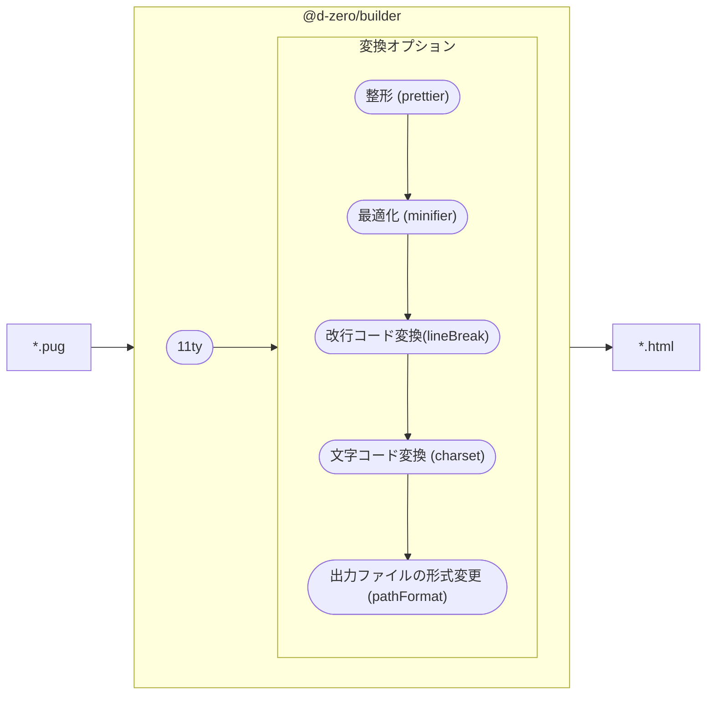

# HTMLガイドライン

🔰 当ドキュメントは「[コーディングガイドライン](./index.md)」の一部です。
基本的なガイドライン・ルールについては先にそれから確認してください。

## 🎯 HTMLガイドラインの目的

HTMLのガイドラインは次の3つを主な目的として規定します。

- セマンティック・アクセシビリティ
  - コンテキスト（文章などの前後の脈絡・文脈）によって最適なマークアップができること
  - 普遍的でアクセシブルなマークアップができること
- 一貫性
  - 一貫したルールがあることで個人の好みや矜持による品質のバラツキを抑えること
  - プロジェクトをまたいでも混乱が少ないこと
- メンテナンス性
  - デザインの変更に対して柔軟で応用が効く汎用的な作りであること
  - コンポーネントの単位で影響範囲を把握しやすく管理できること

### HTMLの品質を支える規格

次の規格やガイドラインを参考に最適な実装をしていきます。

#### HTML Living Standard

原則として[**HTML Living Standard**](https://momdo.github.io/html/)の規定は例外なく従います。

#### WAI-ARIA

WAI-ARIAは[WAI-ARIA 1.2](https://momdo.github.io/wai-aria-1.2/)を基本に、ブラウザや支援技術の実装状況を鑑みながら判断します。

#### WCAG (Web Content Accessibility Guideline)

[WCAG 2.2](https://waic.jp/translations/WCAG22/)の4原則（知覚可能、操作可能、理解可能、堅牢性）に基づいてマシンリーダブルなマークアップをします。

#### APG (ARIA Authoring Practices Guide)

[ARIA Authoring Practices Guide (APG)](https://www.w3.org/WAI/ARIA/apg/)を参考にUIを実装します。特にARIA属性やキーボードの操作については特別な理由がない限りこれに則って実装します。

## 💅 コードスタイル

_editorconfig_、_Markuplint_、_pug-lint_、_Prettier_ それぞれに設定されているルールに則って記述します。エディタやコマンド実行時に警告が出た場合は**必ず修正してください**。

各設定は以下のパッケージを利用しています。

- [@d-zero/markuplint-config](https://github.com/d-zero-dev/linters/tree/main/packages/%40d-zero/markuplint-config)
- [@d-zero/pug-lint-config](https://github.com/d-zero-dev/linters/tree/main/packages/%40d-zero/pug-lint-config)
- [@d-zero/prettier-config](https://github.com/d-zero-dev/linters/tree/main/packages/%40d-zero/prettier-config)

::: danger リントエラーについて
例外なく必ずリントエラーを修正してください。**リンターのルールが現状にそぐわない場合はルールの見直しを行ってください**。
:::

### 改行・インデントのルール

原則としてネストしたタグは行を落としてインデントしてください。親子・兄弟関係を明確にし、エディタのコード折りたたみ機能が有効になりコードが読みやに繋がります。ただし要素のスタイルがインライン（`inline` `inline-block` など）で、前後のホワイトスペースがレンダリングに影響を及ぼす可能性のある箇所についてはこの限りではありません。

<details>
<summary>ルールの例</summary>

<!-- prettier-ignore-start -->
```html
<!-- ✅ 良い例 -->
<ul>
	<li>apple</li>
	<li>orange</li>
	<li>banana</li>
</ul>

<!-- ❌ 悪い例: インデントされていない -->
<ul>
<li>apple</li>
<li>orange</li>
<li>banana</li>
</ul>

<!-- ❌ 悪い例: インデントされている箇所とされてない箇所がある -->
<ul>
	<li>apple</li>
<li>orange</li>
	<li>banana</li>
</ul>

<!-- ✅ 良い例: インラインの要素は改行とインデントの必要はない -->
<div>
	<p>This apple is <strong>red</strong></p>
</div>

<!-- ✅ 良い例: インラインの要素は改行とインデントの必要はない -->
<ul>
	<li><a href="/apple/">apple</a></li>
	<li><a href="/orange/">orange</a></li>
	<li><a href="/banana/">banana</a></li>
</ul>

<!-- ❌ 悪い例: 明らかにa要素はインラインでない -->
<a href="/path/to/link"><div>
	
	<p>lorem...</p>
</div></a>

<!-- ✅ 良い例: 明らかにa要素はインラインでない -->
<a href="/path/to/link">
	<div>
		
		<p>lorem...</p>
	</div>
</a>
```
<!-- prettier-ignore-end -->

</details>

::: tip 🔧 自動修正可能
このルールは*Prettier*によって自動修正されます。
:::

### タグのルール

- タグ名や属性名は小文字に統一します
- 空要素の閉じスラッシュをつけます
- 閉じタグは省略しません

<details>
<summary>ルールの例</summary>

タグ名や属性名は小文字を使用します。

```html
<!-- ✅ 良い例 -->
<a href="/path/to/link">...</a>

<!-- ❌ 悪い例 -->
<a href="/path/to/link">...</a>
```

ただし SVG（インラインSVGも同様）は、属性名の大文字小文字を区別するため、仕様に従います。

```html
<!-- ✅ 良い例 -->
<svg viewBox="0 0 400 300">...</svg>

<!-- ❌ 悪い例 svg要素は正しく大文字小文字を指定しないと動作しない -->
<svg viewbox="0 0 400 300">...</svg>
```

空要素の閉じスラッシュは記述します。本来必要ありませんがPrettierの挙動に従います。

<!-- prettier-ignore-start -->
```html
<!-- ✅ 良い例 -->


<!-- ❌ 悪い例 -->

```
<!-- prettier-ignore-end -->

閉じタグの省略はしません。

<!-- prettier-ignore-start -->
```html
<!-- ✅ 良い例 -->
<ul>
	<li>apple</li>
	<li>orange</li>
	<li>banana</li>
</ul>

<!-- ❌ 悪い例 -->
<ul>
	<li>apple
	<li>orange
	<li>banana
</ul>
```
<!-- prettier-ignore-end -->

</details>

::: tip 🔧 自動修正可能
このルールは*Prettier*によって自動修正されます。
:::

### 属性の引用符ルール

属性値はダブルクォーテーション（二重引用符）を使用します。

<details>
<summary>ルールの例</summary>

<!-- prettier-ignore-start -->
```html
<!-- ✅ 良い例: 属性の引用符にダブルクォーテーションを使用している -->
<a href="/path/to/link">...</a>

<!-- ❌ 悪い例: 属性の引用符にシングルクォーテーションを使用している -->
<a href='/path/to/link'>...</a>

<!-- ❌ 悪い例: 属性に引用符を使用しない -->
<input type=text />
```
<!-- prettier-ignore-end -->

</details>

::: tip 🔧 自動修正可能
このルールは*Prettier*によって自動修正されます。
:::

### 属性の値のルール

論理属性（値が不要の属性）に値を記述しません。

```html
<!-- ✅ 良い例 -->
<input type="checkbox" checked />

<!-- ❌ 悪い例 -->
<input type="checkbox" checked="checked" />
```

デフォルトの属性値が決まっていて省略可能な属性は省略します。

```html
<!-- ✅ 良い例 -->
<script src="/path/to/script.js"></script>

<!-- ❌ 悪い例: script要素のtype属性は省略できる -->
<script type="text/javascript" src="/path/to/script.js"></script>
```

### Pugでの属性指定

- id属性は `#` リテラルを利用します
- class属性は `.` リテラルを利用します
- 指定は次の順番で記述します
  1. **id属性**
  2. **class属性**
  3. class/id以外の属性

<!-- prettier-ignore-start -->
```pug
//- ✅ 良い例
div#id-name.c-class-name(data-attr="value")

//- ❌ 悪い例: 順番どおりでない、そしてclass属性にドットリテラルを使っていない。
div(data-attr="value" class="c-class-name")#id-name
```
<!-- prettier-ignore-end -->

::: tip 🔧 自動修正可能
このルールは*Prettier*と*pug-lint*によって自動修正されます。
:::

### 文字参照

次に挙げる文字は[文字参照](https://ja.wikipedia.org/wiki/%E6%96%87%E5%AD%97%E5%8F%82%E7%85%A7)にします。

| 文字   | 文字参照 |
| ------ | -------- |
| &lt;   | `&lt;`   |
| &gt;   | `&gt;`   |
| &amp;  | `&amp;`  |
| &quot; | `&quot;` |

上記以外の文字は、可読性の観点から文字参照にする必要はありません。コピーライトマークは`&copy;`でなく`©`にします。

属性の文字列内でも文字参照に統一します。

```html
<!-- ✅ 良い例: &が文字参照になっている -->
<a href="/path/to/link?key=val&amp;key=val">...</a>

<!-- ❌ 悪い例: &が文字参照になっていない -->
<a href="/path/to/link?key=val&key=val">...</a>
```

::: tip Pugでの属性値の文字参照

Pugでは属性値の文字参照は自動で行われるため、手動で記述する必要はありません。

```pug
//- 入力
a(href="/path/to/link?key=val&key=val")
```

```html
<!-- 出力結果 -->
<a href="/path/to/link?key=val&amp;key=val"></a>
```

:::

### コメント

<!-- prettier-ignore-start -->
```html
<!-- ✅ 良い例: ハイフンとコメント文の間に最低1つはスペースか改行を入れる -->
<!-- コメント -->

<!-- ❌ 悪い例: ハイフンとコメント文の間にスペースがない -->
<!--コメント-->
```
<!-- prettier-ignore-end -->

::: tip 🤔 コメントを書くかどうか
HTMLに記述したコメントは、製品ソースコード上に残るためエンドユーザが見える状態になります。
そのため、なるべく不用意なコメントは控えたほうがよいです。
CMSへの組み込みなどでメモ代わりに利用する場合は、組み込みの際に消してもらえるように依頼をしてください。

また、PugではHTMLに変換した際に削除されるコメント記法があるので、そういったものを積極的に活用してください。
:::

## 📂 ファイル構成

ファイルは以下の構成で管理します。

```
# 開発ソースコード

📂 __assets/
├── 📂 htdocs/
│ ├── 📂 __tmpl/
│ │ ├── 000_home.pug
│ │ ︙
│ │ └── 302_form_complete.pug
│ ├── 📂 sub-dir/
│ │ ├── sub01.pug
│ │ ︙
│ │ └── sub99.pug
│ ├── index.pug
│ └── maintenance.html
└── 📂 _libs/
    ├── 📂 component/
    │ ├── header.pug
    │ └── footer.pug
    ├── 📂 data/
    │ ├── helper.js
    │ └── index.yaml
    └── 📂 mixin/
    └── meta.pug

# 製品ソースコード

📂 htdocs/
├── 📂 __tmpl/
│ ├── 000_home.html
│ ︙
│ └── 302_form_complete.html
├── 📂 sub-dir/
│ ├── sub01.html
│ ︙
│ └── sub99.html
├── index.html
└── maintenance.html
```

`__assets/htdocs`の**フォルダ構造を維持したまま**にドキュメントルートにあたる`htdocs`に出力されます。最終的に整形されたHTMLファイルをするため、開発ファイルは**PugでもHTMLでもどちらでも構いません**。

`_libs/components`、`_libs/mixin`フォルダはPugで利用する断片要素、`_libs/data`フォルダはPugから参照できるオブジェクトや関数を管理します。

## 🍴 プリプロセッサー・コンパイル環境 {#builder}

`@d-zero/builder`を通してPugからHTMLへの変換を行います。



製品ソースコードの納品要件によっては、改行コードや文字コードの変換が必要なケースがあります。その場合は`eleventy.config.cjs`に変換オプションを追加してください。

```js
module.exports = function (eleventyConfig) {
	if (process.env.NODE_ENV === 'production') {
		eleventyConfig.addGlobalData('prettier', true);
		eleventyConfig.addGlobalData('minifier', { minifyJS: false });
		eleventyConfig.addGlobalData('lineBreak', '\r\n');
		eleventyConfig.addGlobalData('charset', 'shift_jis');
		eleventyConfig.addGlobalData('pathFormat', 'preserve');
	}
	return eleventy(eleventyConfig);
};
```

### 変換オプション

`eleventyConfig.addGlobalData`にオプションを渡します。

#### `prettier`

Prettierによる整形を行います。デフォルトは`true`です。

#### `minifier`

[HTMLMinifier](https://terser.org/html-minifier-terser/)によって最適化を行います。必要であれば[設定](https://github.com/terser/html-minifier-terser?tab=readme-ov-file#options-quick-reference)を上書きしてください。

#### `lineBreak`

改行コードを変換します。**CRLF**（`\r\n`）や**LF**（`\n`）を指定してください。デフォルトは**LF**（`\n`）です。

#### `charset`

文字コードを変換します。文字コードは**UTF-8**（`utf8`）と**Shift-JIS**（`shift_jis`）のみ対応しています。デフォルトは**UTF-8**（`utf8`）です。**Shift-JIS**にするには`shift_jis`を指定し、別途`iconv-lite`のインストールが必要です。

```sh
yarn add -D iconv-lite
```

#### `pathFormat`

出力ファイルの形式を変更します。デフォルトは`preserve`です。

| 値          | 説明                                                             |
| ----------- | ---------------------------------------------------------------- |
| `file`      | 各ページに対応するHTMLファイルを生成                             |
| `directory` | ディレクトリを生成しページに対応する`index.html`ファイルをネスト |
| `preserve`  | ソースフォルダに表示される通りにHTMLファイルを生成               |

この設定は[Astro](https://docs.astro.build/ja/getting-started/)の[`build.format`](https://docs.astro.build/ja/reference/configuration-reference/#buildformat)を参考にしています。

## 📜 DOCTYPE

DOCTYPEは必ず記述します。旧来の文書型宣言は使用しないでください。また、XML宣言は記述しません。

<!-- prettier-ignore-start -->
```html
<!doctype html>
<html>
````
<!-- prettier-ignore-end -->

ただしPugの場合は自動付与されるので記述不要です。

```pug
html
	head
	body
```

## 🔖 メタ要素

### ビューポート

`user-scalable`は無効なため記述しません。

```html
<meta name="viewport" content="width=device-width" />
```

### その他の必須要素

```html
<!-- 数字の連続が電話番号に変換されるのを抑制する -->
<meta name="format-detection" content="telephone=no" />
```

## 🔗 パスとリンク

`href`や`src`属性に記述するパスは、原則 `/` (スラッシュ)で始まるルート相対パスで記述します。
これはCMSなどの動的に生成されるページでも、どの階層からでも同じリンク先を参照できるようにするためです。

```html
<!-- ✅ 良い例 -->
<a href="/path/to/link">...</a>

<!-- ❌ 悪い例 -->
<a href="path/to/link">...</a>
<a href="./path/to/link">...</a>
<a href="../path/to/link">...</a>
```

### 外部リンク

ソースコードの検索性を上げるために`//`で始まるパスは避け、`https://`で開始してください。

```html
<!-- ✅ 良い例 -->
<a href="https://www.d-zero.co.jp" target="_blank" rel="noreferrer">...</a>

<!-- ❌ 悪い例 -->
<a href="//www.d-zero.co.jp" target="_blank" rel="noreferrer">...</a>
```

## 💎 コンポーネント

ページを構成するパーツを**コンポーネント**という単位で管理します。

これは**スタイルシートのための規定**であり、以下のような問題を未然に防ぐことを目的としています。

- クラス名のコンフリクト（重複）および予期しないスタイル上書き
- スタイル変更による子孫要素への予期しない影響

### コンポーネントの構成とクラス命名規則

コンポーネントはそれ自身である**コンポーネントルート**と子孫要素となる**エレメント**で構成されます。

::: tip BEMとの違い
基本的に似た概念をもちます。

| BEMの概念 | ディーゼロの概念 |
| --------- | ---------------- |
| Block     | コンポーネント   |
| Element   | エレメント       |
| Modifier  | 状態             |

と捉えて差し支えありません。classの命名規則はBEMの本家とは異なります。
:::

**コンポーネントルート**はクラス名によって明示的に定義され、【`c-` + `コンポーネント名`】というclassをもちます。
要素の種類・class以外の属性に関しては、コンポーネントに最適なものを選択しマークアップします。（👉[セマンティックとアクセシビリティ](#🤔-セマンティックとアクセシビリティ)）

```html
<!-- "header"コンポーネントの場合 -->
<header class="c-header"></header>
```

**コンポーネントはコンポーネントを内包することができます**。

```html
<!-- "header"コンポーネントの場合 -->
<header class="c-header">
	<!-- ❗内包される"nav-global"コンポーネント -->
	<nav class="c-nav-global"></nav>
</header>
```

コンポーネントルートの子孫要素は、コンポーネント以外は**エレメント**となります。エレメントのclassは【`c-` + `コンポーネント名` + `__` + `エレメント名`】という命名規則でつけます。※ただしこのclassはスタイルシートのために必要なもので、エレメントに対しては必ずしも必要なわけではありません。classのないエレメントが存在してもかまいません。

```html
<!-- "header"コンポーネントの場合 -->
<header class="c-header">
	<div class="c-header__body">
		<div class="c-header__title">
			<h1 class="c-header__site-name"><span>サイト名</span></h1>
			<p class="c-header__description">概要文</p>
		</div>
		<div class="c-header__info">
			<ul class="c-header__links">
				<!-- ❗classのないエレメント -->
				<li>
					<a href="/about-us/"><span>我々について</span></a>
				</li>
				<li>
					<a href="/sitemap/"><span>サイトマップ</span></a>
				</li>
			</ul>
			<a class="c-header__tel" href="tel:0000000000"><span>00-0000-0000</span></a>
		</div>
		<div class="c-header__nav-global-wrapper">
			<!-- 内包される"nav-global"コンポーネント -->
			<nav class="c-nav-global"></nav>
		</div>
	</div>
</header>
```

エレメントの命名規則については次の理由から規定されています。

- 単純な子孫セレクタでは、内包するコンポーネントへの影響をコントロールできない
- 単純な子セレクタ・子孫セレクタでは、ライブラリなどで定義される外部のクラスのコンフリクトを完全に防げない
- どのコンポーネントに帰属するか明瞭
- エレメントの詳細度の差を小さくできる

内包したコンポーネントの子孫に、自分の子孫を定義してはいけません。

```html
<!-- "header"コンポーネントの場合 -->
<header class="c-header">
	<div class="c-header__c-nav-global">
		<!-- 内包される"nav-global"コンポーネント -->
		<nav class="c-nav-global">
			<!-- ✅ 良い例: これは直属のコンポーネントのエレメントなので問題ない -->
			<ul class="c-nav-global__list">
				...
			</ul>

			<!-- ❌ 悪い例: 先祖にあるコンポーネントのエレメントはここには定義できない -->
			<div class="c-header__nav-element">...</div>
		</nav>
	</div>
</header>
```

1つの要素に複数のclassを定義してはいけません。コンポーネントを拡張したい場合は、完全に別のコンポーネントを作ってください。

```html
<!-- ✅ 良い例 -->
<header class="c-header-specific">
	<!-- Elements... -->
</header>

<!-- ❌ 悪い例 -->
<header class="c-header c-header-specific">
	<!-- Elements... -->
</header>
```

### コンポーネントとエレメントの状態管理

要素の状態（BEMでいうところのModifier）は、原則classを用いません。
次の優先順位で状態を管理します。

1. 各HTML要素のもつ属性（`disabled`属性、`required`属性など）
2. ARIA属性（`aria-expanded`、`aria-readonly`など）
3. `data-*`属性

例えば、`disabled`属性を有効にすれば、暗黙的に`aria-disabled`も有効になる性質があるので、関連する属性とARIA属性は二重定義しないようにしてください。

<!-- prettier-ignore-start -->
```html
<!-- ✅ 良い例: ネイティブの属性があるものは属性で管理する -->
<button type="button" disabled>ボタン</button>

<!-- ❌ 悪い例: 属性で済むものをaria属性やdata属性に再定義したりする -->
<button type="button" aria-disabled="true" data-disabled="true">ボタン</button>
```
<!-- prettier-ignore-end -->

:::warning `hidden`属性の扱い
`hidden`属性と`aria-hidden`の意味は異なるため、同じものとして扱ってはいけません。

`aria-hidden`属性は単純に支援技術に要素を隠すためのARIAステートです。しかし`hidden`属性は「現在のページの状態とその要素が関連性がまだない（将来は関連性が出てくる可能性がある）」もしくは「以前は関連性があったが現在はもう関連性がない」という意味を持つためです。値を`until-found`として自動展開可能な要素に対しては`hidden`属性を利用することはもちろんできますが`aria-hidden`とはこれも性質が異なるため代替にはならないことに注意してください。
:::

HTMLの属性にもWAI-ARIAにもどちらにもない状態を管理する場合（例えばスクロール位置でヘッダーの高さが変わる）などは、`data-compact-mode`のような`data-*`属性で定義します。

```html
<!-- 通常は data-compact-mode が false -->
<header class="c-header" data-compact-mode="false"></header>
```

```js
const header = document.querySelector('.c-header');
window.addEventListener(
	'scroll',
	() => {
		// スクロール位置が100pxを超えたらコンパクトモードにする
		header.dataset.compactMode = window.scrollY > 100 ? 'true' : 'false';
	},
	{ passive: true },
);
```

::: danger ❌ スタイルのみの目的に `data-*` 属性を利用する
`data-*`属性はあくまでもJavaScriptで**状態**を変化させるケースで扱います。スタイルのみの目的で`data-*`属性を利用することは避けてください。

```html
<!-- ❌ 悪い例 -->
<header class="c-header">
	<div data-header="inner">
		<div data-header="logo">サイト名</div>
	</div>
</header>

<!-- ✅ 良い例 -->
<header class="c-header">
	<div class="c-header__inner">
		<div class="c-header__logo">サイト名</div>
	</div>
</header>
```

:::

### 粒度とコンポーネントの例

コンポーネントに分割する粒度はプロジェクトごとに異なりますが、以下の例を参考にしてください。なお、再利用できるかどうかは重要ではなく、コンポーネントが独立して完結すること、他のコンポーネントに影響を与えないことが重要です。

メインコンテンツコンポーネントのみ専用のルールがあるので、[メインコンテンツのエレメントとヘルパークラス](#main)を参照してください。

| コンポーネント名         | クラス名            | 望ましい対象の HTML 要素                        | 備考                                                                                                                                                                                                                                       |
| ------------------------ | ------------------- | ----------------------------------------------- | ------------------------------------------------------------------------------------------------------------------------------------------------------------------------------------------------------------------------------------------ |
| ページ                   | `c-page`            | `body`要素                                      | トップページ・下層ページでレイアウトなどが共通している場合。全体レイアウトのスタイルはここに定義する。                                                                                                                                     |
| ページ（トップページ用） | `c-page-home`       | `body`要素                                      | トップページ限定。全体レイアウトのスタイルはここに定義する。                                                                                                                                                                               |
| ページ（下層ページ用）   | `c-page-sub`        | `body`要素                                      | 下層ページ全般。全体レイアウトのスタイルはここに定義する。                                                                                                                                                                                 |
| ヘッダー                 | `c-header`          | `header`要素                                    | ページで一番外側にあるヘッダー要素。ロゴのリンクや、グロナビ以外の小さなリンク集を内包することもある。                                                                                                                                     |
| フッター                 | `c-footer`          | `footer`要素                                    | ページで外側にあるフッター要素。サイトマップのようなリンクリストや組織情報などを内包することもある。                                                                                                                                       |
| グローバルナビゲーション | `c-nav-global`      | `nav`要素                                       | サイトの全体を横断するリンクメニュー。                                                                                                                                                                                                     |
| ローカルナビゲーション   | `c-nav-local`       | 特になし                                        | 自分のページの兄弟・下層のリンクメニュー。                                                                                                                                                                                                 |
| メインコンテンツ         | `c-content-main`    | `main`要素もしくは`article`要素を先祖にもつ要素 | ページの主要素。CMSで管理されるページや記事の本文にあたる部分が該当する。このコンポーネントのみ扱いが特殊になる。（👉[メインコンテンツのエレメントとヘルパークラス](#main)）                                                               |
| コンテンツインデックス   | `c-content-index`   | `main`要素を先祖にもつ要素                      | 各ページへの目次・リンク集となっているページで利用されるコンポーネント。CMSで管理されるブログ記事一覧やカテゴリーインデックス・タグインデックスなどで利用される。                                                                          |
| パンくずリスト           | `c-nav-breadcrumbs` | 特になし                                        | [Google の推奨する構造化データ](https://developers.google.com/search/docs/advanced/structured-data/breadcrumb?hl=ja#microdata)を利用すること。形式は microdata（schema.org）が望ましい。HTML の構造上難しければ JSON-LD を利用すると良い。 |
| ステップナビゲーション   | `c-nav-steps`       | 特になし                                        |
| ページネーション         | `c-pagination`      | 特になし                                        |
| メインビジュアル         | `c-hero`            | `section`                                       |
| 検索フォーム             | `c-search`          | 特になし                                        |

#### コンポーネント化すべきでないパーツや要素

再利用よりも他の要素への影響がないことを優先するために、次に挙げるパーツ・要素はコンポーネント化を避けてください。

- ボタン単体
- フォームコントロール要素（テキストフィールド・ラジオボタン・セレクトボックスなど）単体

コンポーネントごとに微妙なサイズ感やインタラクションがあることが多いのでコンポーネントとして独立は避け、コンポーネントの**エレメント**として扱ってください。同じデザインでも**再利用よりも他への影響がないことを優先してください**。

```html
<header class="c-header">
	<button class="c-header__btn">ボタン</button>
</header>

<footer class="c-footer">
	<button class="c-footer__btn">ボタン</button>
</footer>
```

### コンポーネント・エレメントの命名規則

クラス名は、ファイル名に関係するので機能から検索・サジェスト・ソートしやすいように、`[機能名]-[修飾語・詳細]-[連番]`という組み合わせで命名します。文法上は不自然かもしれませんが機能性を優先させます。`[機能名]`以外は任意です。それぞれの単語や形容詞はコーディング全般に関わる識別子の命名規則に準じてください（👉[識別子の命名規則](./naming.md)）。

#### 機能名の例

- `page`
- `header`
- `footer`
- `nav`

#### 修飾語・詳細が付いた例

- `nav-global`
- `nav-local`
- `nav-breadcrumbs`
- `nav-steps`
- `page-home`
- `page-sub`
- `page-contact`

#### 連番が付いた例

- `selection-01`
- `selection-02`

## 📖 メインコンテンツのエレメントとヘルパークラス {#main}

メインコンテンツ（`content-main`コンポーネント）の内容はCMSなどで管理されるHTMLを含んだり、ページ独自のスタイルを扱うことが多いので例外的に専用のルールを設けます。

```html
<div class="c-content-main">
	<!-- ❗この部分がメインコンテンツ専用のルール -->
</div>
```

### エレメントのクラスの例外とクラス追加のルール

メインコンテンツのエレメントは基本的に自由です。ただし、クラス名は`c-`で開始しないでください。また、メインコンテンツの中にコンポーネントを内包してはいけません。

```html
<div class="c-content-main">
	<!-- ✅ 良い例 -->
	<div class="foo">...</div>

	<!-- ❌ 悪い例 -->
	<div class="c-content-main__foo">...</div>

	<!-- ❌ 悪い例 -->
	<div class="c-foo">...</div>
</div>
```

## 🆔 id属性の利用

`id`属性はスタイルシートの目的では指定しないでください。

## 🤔 セマンティックとアクセシビリティ

各要素のコンテンツモデルを理解し、コンポーネントや機能、文脈によって最適なタグを選択してください。

### WAI-ARIA

WAI-ARIAをHTMLに付加することで、HTMLでは不足している要素のセマンティックを補うことができます。しかし、WAI-ARIAが必要なケースは多くなく、HTML標準では再現できないコンポーネントを作成するときのみ使用してください。その場合、[ARIA Authoring Practices Guide (APG)](https://www.w3.org/WAI/ARIA/apg/)を参考にして、インタラクションの要件や振る舞いを推奨されているものに近い実装をするようにしてください。

- 🙆 WAI-ARAIを使う必要があるケース
  - `button`要素が`aria-pressed`や`aria-expanded`などの状態をもつ必要がある場合
  - タブやカルーセルなどHTMLにないコンポーネントを扱う場合
- 🙅 WAI-ARIAを使う必要がないケース
  - HTML標準にコンポーネントが存在する場合
  - Popoverなどで事済む場合

### 画像と代替テキスト

代替テキストはWCAGの[達成基準 1.1.1 非テキストコンテンツ](https://waic.jp/translations/WCAG22/#non-text-content)を基準に考えてください。**同等の目的**が重要となるため、コーディングではなくデザインの段階で代替テキストが決まるように計画を立ててください。

::: tip `alt`属性が空の場合のロール

`alt`属性を空にすると、`role="none"`（または`role="presentation"`）を付与したことと同じ効果が得られます。そのため`alt`属性が空の場合は`role="none"`を付与する必要はありません。

```html
<!-- ❌ role="none"は不要 -->

```

:::

### `img`要素の性質を理解する

`img`要素の扱いでは次のことに注意してください。

#### 画像の出し分け

`display: none`の状態でも画像リソースのリクエストはされます（ `loading="lazy"`になっている場合を除く）。そのため、レスポンシブデザインで画像を出し分ける場合は **`picture`要素**をつかってください。

```html
<!-- ✅ 良い例 -->
<picture>
	<source srcset="/path/to/pict-some@xs.jpg" media="(max-width: 575px)" />
	
</picture>

<!-- ❌ 悪い例 -->


```

#### レイアウトシフトを発生させない

- `width`属性と`height`属性を指定して縦横比を明示しないといけないケース
  - 親要素に依存せず画像を成り行きで表示させる場合
  - 親要素によって幅は変わるが、高さが画像によって可変する場合
- 明示しなくていいケース
  - CSS で `width`と `height` を同時に指定している場合（ただし `height` が `auto` でない）
  - CSS で `width` か `height` のどちらかを指定していて、且つ `aspect-ratio` を指定している場合
  - 幅と高さが親要素に完全に依存して、CSS の `object-fit` を使っている場合

#### 遅延デコード・遅延読み込みの設定

- `decoding`属性はブラウザが適宜最適化しているため、指定しない
- ファーストビュー以下の`img`要素にはなるべく`loading="lazy"`を指定して、表示領域にない要素の自動ダウンロードを避ける

### 見出しとアウトライン

見出し要素のみでアウトラインを構成してもよいですし、セクショニング・コンテンツを利用してアウトラインを構成してもよいです。

```html
<!-- ✅ 見出し要素のみでアウトラインを構成する -->
<h1>大見出し</h1>
<div>大見出しのコンテキスト</div>
<h2>中見出し</h2>
<div>中見出しのコンテキスト</div>
<h3>小見出し</h3>
<div>小見出しのコンテキスト</div>

<!-- ✅ セクショニング・コンテンツを利用した場合 -->
<h1>大見出し</h1>
<div>大見出しのコンテキスト</div>
<section>
	<h2>中見出し</h2>
	<div>中見出しのコンテキスト</div>
	<section>
		<h3>小見出し</h3>
		<div>小見出しのコンテキスト</div>
	</section>
</section>
```

::: danger 見出しレベルの注意点

```html
<!-- ❌ 廃止されたアウトラインアルゴリズムでランクを作る -->
<h1>大見出し</h1>
<div>大見出しのコンテキスト</div>
<section>
	<h1>中見出し</h1>
	<div>中見出しのコンテキスト</div>
	<section>
		<h1>小見出し</h1>
		<div>小見出しのコンテキスト</div>
	</section>
</section>

<!-- ❌ 見出しレベルのスキップ -->
<h1>大見出し</h1>
<div>大見出しのコンテキスト</div>
<section>
	<h6>中見出し</h6>
	<div>中見出しのコンテキスト</div>
	<section>
		<h4>小見出し</h4>
		<div>小見出しのコンテキスト</div>
	</section>
</section>
```

:::

### ランドマーク

各コンポーネントの先祖となる要素にはランドマークを設けること。もしくはコンポーネントルート自体をランドマークをもつ要素でマークアップしてください。

```html
<body>
	<header><!-- header は banner ランドマークをもつ --></header>
	<nav><!-- nav は navigation ランドマークをもつ --></nav>
	<main><!-- main は main ランドマークをもつ --></main>
	<footer><!-- footer は contentinfo ランドマークをもつ --></footer>
</body>
```

```html
<body>
	<header><!-- ... --></header>
	<div class="c-hero">
		<!-- ❌ どのランドマークにも属していない -->
	</div>
	<nav><!-- ... --></nav>
	<main>
		<div class="c-hero">
			<!-- ✅ mainランドマークに内包されている -->
		</div>
	</main>
	<footer><!-- ... --></footer>
</body>
```

::: warning 重複するランドマークロールの注意

ドキュメント内に複数のランドマーク要素がある場合、**明示的にアクセシブルな名前を設定してください**。

```html
<body>
	<header>
		<nav aria-label="メインメニュー"><!-- ... --></nav>
	</header>
	<main>
		<nav aria-label="ページ内メニュー"><!-- ... --></nav>
	</main>
	<footer>
		<nav aria-labelledby="sitemap">
			<h2 id="sitemap">ページ一覧</h2>
			<!-- ... -->
		</nav>
	</footer>
</body>
```

:::

### `p`要素を濫用しない

`p`要素は**段落**を表しますが、他の要素で補えるテキストであれば`p`要素を使う必要はありません。また、テキストや文字の代替画像でないかぎり画像単体を`p`要素で囲うのは不適切と言えます。

```html
<!-- ❌ 悪い例 -->
<section>
	<h2>見出し</h2>
	<!-- 文章テキストの代替画像でなければ"段落"にする必要はない -->
	<p></p>
	<p>〜コンテキスト〜</p>
</section>
```
