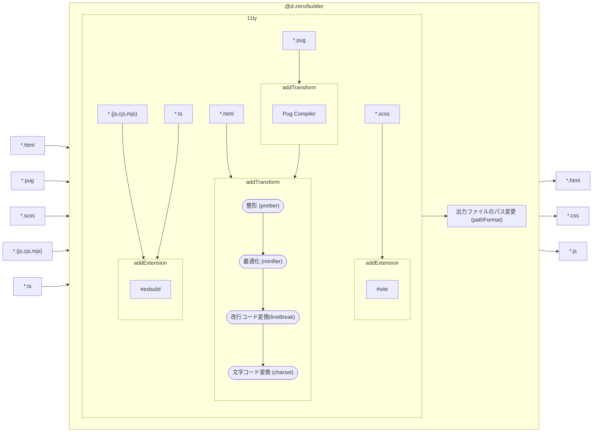

# ビルド環境 {#builder}

`@d-zero/builder`を通してPugからHTMLへの変換を行います。



製品ソースコードの納品要件によっては、改行コードや文字コードの変換が必要なケースがあります。その場合は`eleventy.config.mjs`に変換オプションを追加してください。

```js
import path from 'node:path';

import eleventy from '@d-zero/builder/11ty';

export default function (eleventyConfig) {
	return eleventy(eleventyConfig, {
		alias: {
			'@': path.resolve(import.meta.dirname, '__assets', '_libs'),
		},
		outputCssDir: 'css',
		outputJsDir: 'js',
		outputImgDir: 'img',
		imageSizes: { selector: '*' },
		prettier: false,
		minifier: { minifyJS: false },
		lineBreak: '\n', // or '\r\n'
		charset: 'utf8', // or 'shift_jis',
		pathFormat: 'preserve', // or 'file' or 'directory'
		autoDecode: false, // or true
		ssi: {
			'**/*': {
				encoding: 'utf8', // or 'shift_jis',
			},
		},
	});
}
```

## 変換オプション

`@d-zero/builder/11ty`からインポートしたコンフィギュレーション関数`eleventy()`の第二引数にオプションを渡します。

### `alias`

パスのエイリアスを設定します。

Pugでは`@`に指定したパスがルートとして解釈されます。次のパスは同じ場所を参照します。

| ファイル   | ベースディレクトリへの参照         |
| ---------- | ---------------------------------- |
| Pug        | `include /same-dir/a.pug`          |
| Sass       | `@import '@/same-dir/a.scss'`      |
| TypeScript | `import {} from '@/same-dir/a.js'` |

### `imageSizes`

画像の`width`/`height`属性を自動付与します。`selector`オプションにCSSセレクタを指定することで、対象範囲を限定することができます。

### `prettier`

*Prettier*による整形を行います。デフォルトは`true`です。

### `minifier`

[_HTMLMinifier_](https://terser.org/html-minifier-terser/)によって最適化を行います。必要であれば[設定](https://github.com/terser/html-minifier-terser?tab=readme-ov-file#options-quick-reference)を上書きしてください。

### `lineBreak`

改行コードを変換します。**CRLF**（`\r\n`）や**LF**（`\n`）を指定してください。デフォルトは**LF**（`\n`）です。

### `charset`

HTMLを出力する際に文字コードを変換します。文字コードは**UTF-8**（`utf8`）と**Shift-JIS**（`shift_jis`）のみ対応しています。デフォルトは**UTF-8**（`utf8`）です。

`overrides`オプションで特定のファイルに限定することが可能です。

```js
eleventy(eleventyConfig, {
	charset: {
		encoding: 'utf8', // グローバル設定
		overrides: {
			paths: ['legacy/pages/**/*'],
			encoding: 'shift_jis', // 特定のページへの設定
		},
	},
});
```

### `pathFormat`

出力ファイルの形式を変更します。デフォルトは`preserve`です。

| 値          | 説明                                                             |
| ----------- | ---------------------------------------------------------------- |
| `file`      | 各ページに対応するHTMLファイルを生成                             |
| `directory` | ディレクトリを生成しページに対応する`index.html`ファイルをネスト |
| `preserve`  | ソースフォルダに表示される通りにHTMLファイルを生成               |

この設定は[_Astro_](https://docs.astro.build/ja/getting-started/)の[`build.format`](https://docs.astro.build/ja/reference/configuration-reference/#buildformat)を参考にしています。

## 開発用ローカルサーバーのオプション

### `autoDecode`

自動デコードを有効にします。開発用ローカルサーバーは**UTF-8**しか対応していないため、**Shift-JIS**のファイルを開いた場合に自動でUTF-8に変換します。

### `ssi`

開発用ローカルサーバーでSSI（Server Side Includes）を再現する設定です。簡易的なものになるので`#include`ディレクティブのみに対応しています。文字コードを自動で判定できないのでUTF-8以外に変更する必要がある場合は、対象ファイルのパターンに対して`encoding`を指定します。
