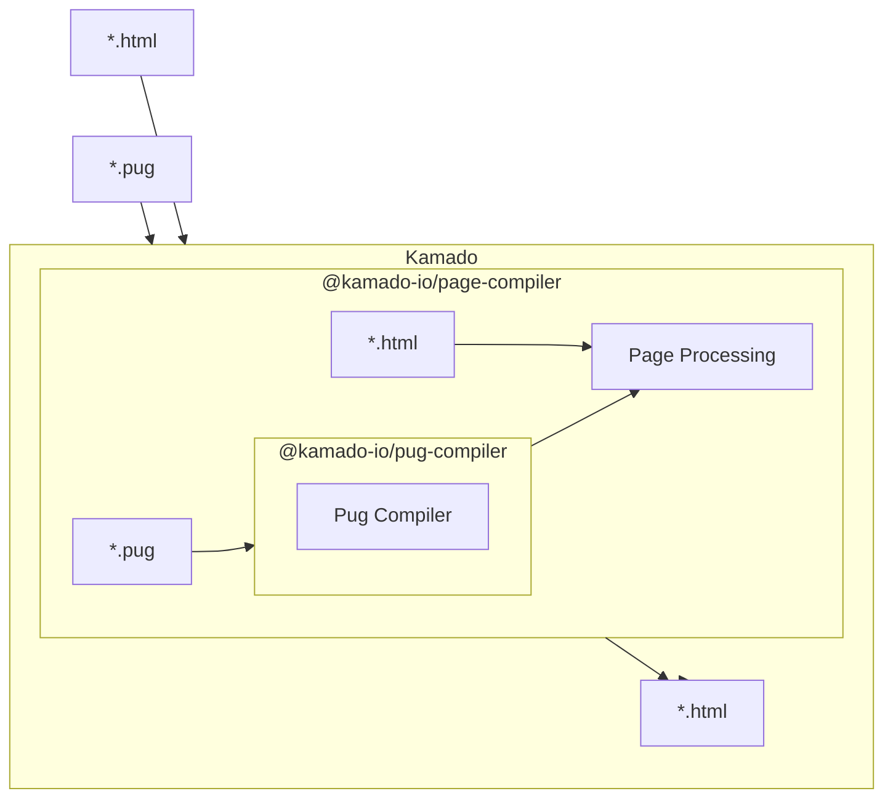

# ビルド環境 {#builder}

[Kamado](https://github.com/d-zero-dev/kamado)と`@kamado-io/page-compiler`を通してPugからHTMLへの変換を行います。


```mermaid
flowchart LR
	#inHTML["*.html"]
	#inPug["*.pug"]
	#outHTML["*.html"]

	#inHTML --> #kamado
	#inPug --> #kamado
	#kamado --> #outHTML

	subgraph #kamado["Kamado"]
		direction LR

		subgraph #pageCompiler["@kamado-io/page-compiler"]
			direction TB

			#html["*.html"]
			#pug["*.pug"]

			subgraph #pugCompiler["@kamado-io/pug-compiler"]
				direction TB

				#pugCompile["Pug Compiler"]
			end

			#html --> #pageProcess["Page Processing"]
			#pug --> #pugCompiler --> #pageProcess
		end

		#pageCompiler --> #outHTML
	end
```

`kamado.config.ts`で設定を行います。

```ts
import type { UserConfig } from 'kamado/config';

import path from 'node:path';

import { pageCompiler } from '@kamado-io/page-compiler';
import { createCompileHooks } from '@kamado-io/pug-compiler';

export const config: UserConfig = {
	dir: {
		root: import.meta.dirname,
		input: path.resolve(import.meta.dirname, '__assets', 'htdocs'),
		output: path.resolve(import.meta.dirname, 'htdocs'),
	},
	compilers: {
		page: pageCompiler({
			globalData: {
				dir: path.resolve(import.meta.dirname, '__assets', '_libs', 'data'),
			},
			layouts: {
				dir: path.resolve(import.meta.dirname, '__assets', '_libs', 'layouts'),
			},
			compileHooks: createCompileHooks({
				pathAlias: path.resolve(import.meta.dirname, '__assets', '_libs'),
			}),
		}),
	},
};

export default config;
```

## コンパイラ設定

### `pageCompiler`

`@kamado-io/page-compiler`はHTMLページのコンパイルを担当します。Pugテンプレートを使用する場合は`@kamado-io/pug-compiler`と組み合わせて使用します。

#### `globalData`

グローバルデータファイルのディレクトリを指定します。このディレクトリ内のデータファイルがすべてのページで利用可能になります。

```ts
globalData: {
	dir: path.resolve(import.meta.dirname, '__assets', '_libs', 'data'),
}
```

#### `layouts`

レイアウトファイルのディレクトリを指定します。

```ts
layouts: {
	dir: path.resolve(import.meta.dirname, '__assets', '_libs', 'layouts'),
}
```

#### `compileHooks`

カスタムコンパイルフックを設定します。Pugテンプレートを使用する場合は`@kamado-io/pug-compiler`の`createCompileHooks`を使用します。

```ts
import { createCompileHooks } from '@kamado-io/pug-compiler';

compileHooks: createCompileHooks({
	pathAlias: path.resolve(import.meta.dirname, '__assets', '_libs'),
}),
```

### `pathAlias`

Pugテンプレート内で使用するパスエイリアスを設定します。`@`に指定したパスがルートとして解釈されます。

次のパスは同じ場所を参照します。

| ファイル   | ベースディレクトリへの参照         |
| ---------- | ---------------------------------- |
| Pug        | `include /same-dir/a.pug`          |
| CSS        | `@import '@/same-dir/a.css'`       |
| TypeScript | `import {} from '@/same-dir/a.js'` |

## 開発サーバー

Kamadoの開発サーバーはオンデマンドビルド方式を採用しています。ブラウザでアクセスしたページがリクエスト時に自動的にビルドされます。

```bash
yarn dev
```

開発サーバーはファイル監視を行わず、ブラウザのリロードによるサーバーリクエストのみがビルドのトリガーとなります。
